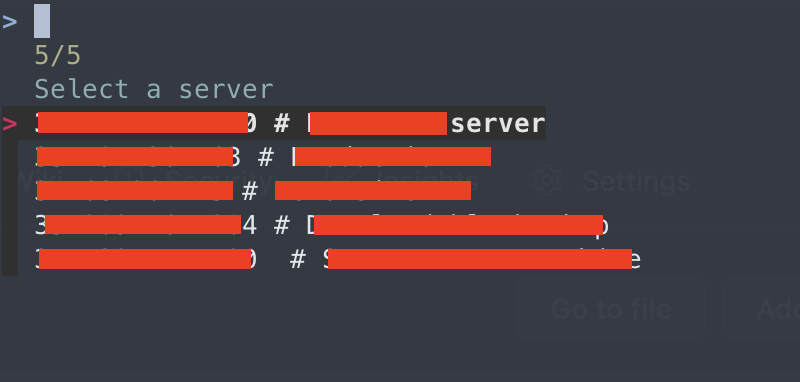

# reallySimpleLoginHandler
A really simple way to store you logins to servers.

```shell
Usage: l0g1n.py [OPTIONS]
Try 'l0g1n.py --help' for help.
```

Feature:
- collect login info from ~/.ssh/config ([example](./config))
- simply parse it
- pipe into an fzf


